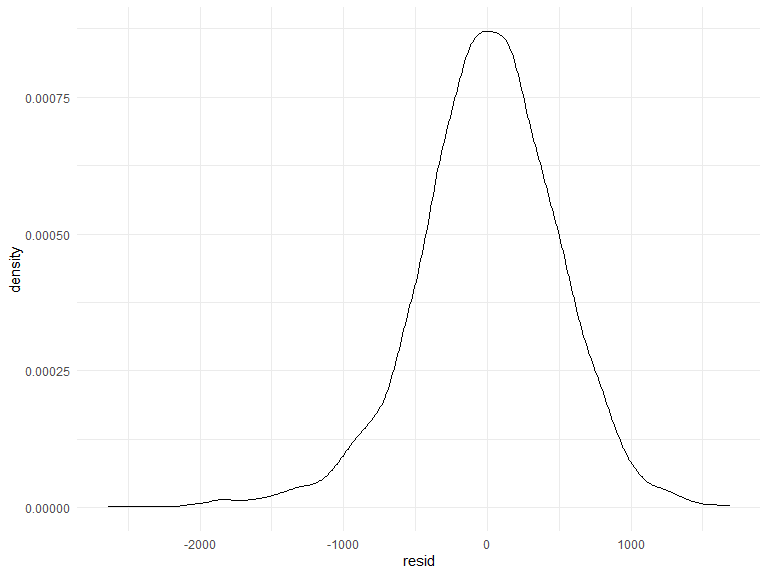

p8105_hw6_yh3430
================
Yu He
11/28/2021

Load libraries

``` r
library(tidyverse)
```

    ## -- Attaching packages --------------------------------------- tidyverse 1.3.1 --

    ## v ggplot2 3.3.5     v purrr   0.3.4
    ## v tibble  3.1.4     v dplyr   1.0.7
    ## v tidyr   1.1.3     v stringr 1.4.0
    ## v readr   2.0.1     v forcats 0.5.1

    ## -- Conflicts ------------------------------------------ tidyverse_conflicts() --
    ## x dplyr::filter() masks stats::filter()
    ## x dplyr::lag()    masks stats::lag()

``` r
library(viridis)
```

    ## Loading required package: viridisLite

``` r
library(modelr)

knitr::opts_chunk$set(
    echo = TRUE,
    warning = FALSE,
    fig.width = 8, 
  fig.height = 6,
  out.width = "90%"
)
options(
  ggplot2.continuous.colour = "viridis",
  ggplot2.continuous.fill = "viridis"
)
scale_colour_discrete = scale_colour_viridis_d
scale_fill_discrete = scale_fill_viridis_d
theme_set(theme_minimal() + theme(legend.position = "bottom"))
```

## Problem 1

## problem 1 model 1

import and clean data

``` r
birthweight_data =
  read_csv("birthweight.csv") %>% 
  mutate(
    babysex = factor(babysex),
    frace = factor(frace),
    malform = factor(malform),
    mrace = factor(mrace)
  )
```

    ## Rows: 4342 Columns: 20

    ## -- Column specification --------------------------------------------------------
    ## Delimiter: ","
    ## dbl (20): babysex, bhead, blength, bwt, delwt, fincome, frace, gaweeks, malf...

    ## 
    ## i Use `spec()` to retrieve the full column specification for this data.
    ## i Specify the column types or set `show_col_types = FALSE` to quiet this message.

Let’s check if there is missing values

``` r
sum(is.na(birthweight_data))
```

    ## [1] 0

Let’s make a plot to see some data

``` r
birthweight_data %>% 
  ggplot(aes(x = fincome, y = bwt)) +
  geom_point()
```


``` r
birthweight_data %>% 
  ggplot(aes(x = ppbmi, y = bwt)) +
  geom_point()
```


Let’s fit a linear model

``` r
fit_df = lm(bwt ~ fincome + ppbmi, data = birthweight_data)
summary(fit_df)
```

    ## 
    ## Call:
    ## lm(formula = bwt ~ fincome + ppbmi, data = birthweight_data)
    ## 
    ## Residuals:
    ##      Min       1Q   Median       3Q      Max 
    ## -2604.24  -291.75    13.29   326.34  1711.33 
    ## 
    ## Coefficients:
    ##              Estimate Std. Error t value Pr(>|t|)    
    ## (Intercept) 2641.1589    54.2260  48.707  < 2e-16 ***
    ## fincome        3.0863     0.2944  10.485  < 2e-16 ***
    ## ppbmi         15.6290     2.4028   6.504 8.68e-11 ***
    ## ---
    ## Signif. codes:  0 '***' 0.001 '**' 0.01 '*' 0.05 '.' 0.1 ' ' 1
    ## 
    ## Residual standard error: 503.7 on 4339 degrees of freedom
    ## Multiple R-squared:  0.03332,    Adjusted R-squared:  0.03287 
    ## F-statistic: 74.77 on 2 and 4339 DF,  p-value: < 2.2e-16

Diagnostics

``` r
add_residuals(birthweight_data, fit_df) %>% 
  ggplot(aes(x = fincome, y = resid)) +
  geom_point() +
  geom_point(aes(x = ppbmi, color = "red"))
```


``` r
add_residuals(birthweight_data, fit_df) %>% 
  ggplot(aes(x = resid)) +
  geom_density()
```



## problem 1 model 2 and 3

model 2 using birth length and gestational age in weeks at predictors

``` r
fit_df2 = lm(bwt ~ blength + gaweeks, data = birthweight_data)
summary(fit_df2)
```

    ## 
    ## Call:
    ## lm(formula = bwt ~ blength + gaweeks, data = birthweight_data)
    ## 
    ## Residuals:
    ##     Min      1Q  Median      3Q     Max 
    ## -1709.6  -215.4   -11.4   208.2  4188.8 
    ## 
    ## Coefficients:
    ##              Estimate Std. Error t value Pr(>|t|)    
    ## (Intercept) -4347.667     97.958  -44.38   <2e-16 ***
    ## blength       128.556      1.990   64.60   <2e-16 ***
    ## gaweeks        27.047      1.718   15.74   <2e-16 ***
    ## ---
    ## Signif. codes:  0 '***' 0.001 '**' 0.01 '*' 0.05 '.' 0.1 ' ' 1
    ## 
    ## Residual standard error: 333.2 on 4339 degrees of freedom
    ## Multiple R-squared:  0.5769, Adjusted R-squared:  0.5767 
    ## F-statistic:  2958 on 2 and 4339 DF,  p-value: < 2.2e-16

model 3 using head circumference, length, sex and all interactions

``` r
fit_df3 = lm(bwt ~ babysex + bhead + blength + babysex * bhead + babysex * blength + bhead * blength + babysex * bhead * blength, data = birthweight_data)
summary(fit_df3)
```

    ## 
    ## Call:
    ## lm(formula = bwt ~ babysex + bhead + blength + babysex * bhead + 
    ##     babysex * blength + bhead * blength + babysex * bhead * blength, 
    ##     data = birthweight_data)
    ## 
    ## Residuals:
    ##      Min       1Q   Median       3Q      Max 
    ## -1132.99  -190.42   -10.33   178.63  2617.96 
    ## 
    ## Coefficients:
    ##                          Estimate Std. Error t value Pr(>|t|)    
    ## (Intercept)            -7176.8170  1264.8397  -5.674 1.49e-08 ***
    ## babysex2                6374.8684  1677.7669   3.800 0.000147 ***
    ## bhead                    181.7956    38.0542   4.777 1.84e-06 ***
    ## blength                  102.1269    26.2118   3.896 9.92e-05 ***
    ## babysex2:bhead          -198.3932    51.0917  -3.883 0.000105 ***
    ## babysex2:blength        -123.7729    35.1185  -3.524 0.000429 ***
    ## bhead:blength             -0.5536     0.7802  -0.710 0.478012    
    ## babysex2:bhead:blength     3.8781     1.0566   3.670 0.000245 ***
    ## ---
    ## Signif. codes:  0 '***' 0.001 '**' 0.01 '*' 0.05 '.' 0.1 ' ' 1
    ## 
    ## Residual standard error: 287.7 on 4334 degrees of freedom
    ## Multiple R-squared:  0.6849, Adjusted R-squared:  0.6844 
    ## F-statistic:  1346 on 7 and 4334 DF,  p-value: < 2.2e-16

## problem 1 use CV to compare models

``` r
cv_df_p1 = 
  crossv_mc(birthweight_data, 100) %>% 
  mutate(
    train = map(train, as_tibble),
    test = map(test, as_tibble)
  )
```

fit models and extract RMSE

``` r
cv_df1_RMSE =
  cv_df_p1 %>% 
  mutate(
    mod_df1 = map(.x = train, ~lm(bwt ~ fincome + ppbmi, data = .x)),
    mod_df2 = map(.x = train, ~lm(bwt ~ blength + gaweeks, data = .x)),
    mod_df3 = map(.x = train, ~lm(bwt ~ babysex + bhead + blength + babysex * bhead + babysex * blength + bhead * blength + babysex * bhead * blength, data = .x))
  ) %>% 
  mutate(
    rmse_df1 = map2_dbl(.x = mod_df1, .y = test, ~rmse(model = .x, data = .y)),
    rmse_df2 = map2_dbl(.x = mod_df2, .y = test, ~rmse(model = .x, data = .y)),
    rmse_df3 = map2_dbl(.x = mod_df3, .y = test, ~rmse(model = .x, data = .y))
  )
```

RMSE distribution

``` r
cv_df1_RMSE %>% 
  select(.id, starts_with("rmse")) %>% 
    pivot_longer(
    rmse_df1:rmse_df3,
    names_to = "model", 
    values_to = "rmse",
    names_prefix = "rmse_"
  ) %>% 
  ggplot(aes(x = model, y = rmse)) + 
  geom_boxplot()
```


## Problem 2

load the dataset

``` r
weather_df = 
  rnoaa::meteo_pull_monitors(
    c("USW00094728"),
    var = c("PRCP", "TMIN", "TMAX"), 
    date_min = "2017-01-01",
    date_max = "2017-12-31") %>%
  mutate(
    name = recode(id, USW00094728 = "CentralPark_NY"),
    tmin = tmin / 10,
    tmax = tmax / 10) %>%
  select(name, id, everything())
```

    ## Registered S3 method overwritten by 'hoardr':
    ##   method           from
    ##   print.cache_info httr

    ## using cached file: C:\Users\IT\AppData\Local/Cache/R/noaa_ghcnd/USW00094728.dly

    ## date created (size, mb): 2021-10-11 20:39:39 (7.62)

    ## file min/max dates: 1869-01-01 / 2021-10-31

Let’s try bootstrapping

Part 1 identify the r squared CI

``` r
weather_bootstrap_results =
  weather_df %>% 
  bootstrap(n = 5000, id = "strap_number") %>% 
  mutate(
    models = map(.x = strap, ~lm(tmax ~ tmin, data = .x)),
    results = map(models, broom::glance)
  ) %>% 
  select(strap_number, results) %>% 
  unnest(results)
```

``` r
weather_bootstrap_results %>% 
  janitor::clean_names() %>% 
  summarize(
    ci_lower = quantile(r_squared, 0.025),
    ci_upper = quantile(r_squared, 0.975)
  )
```

    ## # A tibble: 1 x 2
    ##   ci_lower ci_upper
    ##      <dbl>    <dbl>
    ## 1    0.893    0.927

Part 2 log(β<sup>0∗β</sup>1) CI

``` r
weather_bootstrap2_results =
  weather_df %>% 
  bootstrap(n = 5000, id = "strap_number") %>% 
  mutate(
    models = map(.x = strap, ~lm(tmax ~ tmin, data = .x)),
    results = map(models, broom::tidy)
  ) %>% 
  select(strap_number, results) %>% 
  unnest(results)
```

``` r
weather_bootstrap2_results %>% 
  janitor::clean_names() %>% 
  select(term, estimate) %>% 
  pivot_wider(
    names_from = term,
    values_from = estimate
  ) %>%
  janitor::clean_names() %>% 
  unnest(tmin) %>% 
  unnest(intercept) %>% 
  mutate(
    log_data = log(intercept*tmin)
  ) %>% 
  summarize(
    ci_lower = quantile(log_data, 0.025), 
    ci_upper = quantile(log_data, 0.975)
  )
```

    ## # A tibble: 1 x 2
    ##   ci_lower ci_upper
    ##      <dbl>    <dbl>
    ## 1     1.94     2.09
